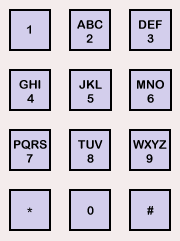

# `Phone Letters`

Previously, people typed words on a phone by pressing combinations of numbers. Each number mapped to a few different possible letters, as shown below.



For example, you would type the word "urbit" with the numbers 87248, because u maps to 8, r maps to 7, b maps to 2, i maps to 4, and t maps to 8.

In this task, you will write a generator that accepts a `@ud` number and returns a `(list tape)` containing all the different strings that it could represent.

* Note that `1` and `0` do not map to any letters in the phonepad. Let's crash if the input `@ud` contains any `1` or `0`.
* Let's return the list of strings sorted in alphabetical order, all in lowercase.

Recall that `@ud` numbers need a dot marking every three digit places if the number is higher than `999`, i.e. `234.567.892` is `234,567,892`.
  
Example usage:
```
> +phone-letters 29
<<"aw" "ax" "ay" "az" "bw" "bx" "by" "bz" "cw" "cx" "cy" "cz">>
```

Two winners will be rewarded. **Fastest Solution** will go to the first person to send in a working solution. **Best Style** will be measured by a variety of factors, including clarity, elegance, following Hoon-ish conventions, being well-commented, and code runtime. For examples, see the challenges and winners from our last competition [[1]](https://docs.urbit.org/language/hoon/examples/emirp) [[2]](https://docs.urbit.org/language/hoon/examples/restore-ip) [[3]](https://docs.urbit.org/language/hoon/examples/islands). You can also refer to the [Hoon Style Guide](https://docs.urbit.org/language/hoon/guides/style).


For submission, fill out this [google form](https://forms.gle/Xi4ibZ8ayai9EpfW9) with your information. See instructions to create the repository below. Remember to make your repo private and add tamlut-modnys as a collaborator.

This challenge opens at 11am ET (8am PT, 5pm Central Europe) on August 17, and will close at the same time on August 24. Good luck!

## Using this Repository

**Please _do not fork this repository directly on GitHub._**  Instead, please use GitHub's "template" function following [the instructions below](#creating-a-repository) to copy this repository and customize it for your project.

If you are working with a fakeship, this is one way to set things up for rapid development:

1. Start a fakeship and `|mount %base`.
2. Clone this repo into the same directory as the fakeship, then copy the contents of `src/` into `zod/base/`.
3. Develop either in `zod/base/` or in this repo folder directly.  It's probably a bit easier to develop in the fakeship and copy back here frequently.

## Testing

This repo provides test cases you can use to verify that your code submission works correctly.

To run the tests, make sure you have mounted and committed the files into the `base` folder of your fake ship. Then from dojo run
```
-test %/tests/phone-letters/hoon
```
This will run several tests, each of which will pass or fail. For debugging help you can inspect the test code to see which ones passed and failed.

To avoid issues, make sure your generator is written in the provided file at `/gen/phone-letters.hoon`

For more info on testing in Hoon, see [this link](https://docs.urbit.org/userspace/apps/guides/unit-tests).

## Creating a Repository

1.  Log in to GitHub.
    (If you do not have an account, you can quickly create one for free.)
    You must be logged in for the remaining steps to work.

2.  On this page, click on the green "Use this template" button (top right)

3.  Select the owner for your new repository.
    (This will probably be you, but may instead be an organization you belong to.)

4.  Choose a name for your copy of the archetype repository.
    We recommend you call it `ha-phone-letters` (no 'template').

5.  Make sure the repository is **private**, leave "Include all branches" unchecked, and click on "Create repository from template". You will be redirected to your new copy of the template respository.

6.  Share the repo with tamlut-modnys on Github as a collaborator.

After this is complete, you can use this repo to handle your competition development and submission. Please note that by submitting a solution, you allow it to be made public under the MIT license.
